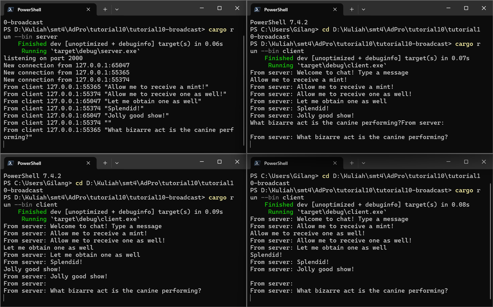

# Reflection

## 2.1. Original code of broadcast chat

To run the server, we run `cargo run --bin server`. To run the client, we run `cargo run --bin client`. We just implemented websocket communication between the server and the client. When any client sends a message, it will be broadcasted to all clients. We can run multiple clients and see the messages being broadcasted to all clients.